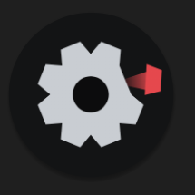

# Gearslip

Bring any app to your car screen.

## What Gearslip is

Gearslip is an Android Auto client for the phone. It speaks the Android Auto protocol
directly to a car head unit over USB, with no Google software in the path. Gearslip acts
as a Car App Library host: an app that ships a car interface hands Gearslip a template,
and Gearslip renders that template natively on the car screen. Nothing is mirrored from
the phone. For apps without a car interface, Gearslip offers a separate screen-sharing
mode.

The author reverse-engineered the protocol for interoperability, so that a client other
than Google's own can talk to a car head unit.

## Status

- **Templated apps work.** Gearslip renders all 16 template types that the Car App
  Library defines, and it draws its own keyboard for search and sign-in. It has been
  tested against several real navigation and media apps.
- **Media playback works.** Gearslip lets you browse and control car-enabled media apps
  from the car screen, with lyrics and playback state, over the same host connection.
- **A real head unit needs a certificate that Google controls.** A head unit accepts only
  a phone identity that chains to Google's Automotive Link certificate authority, and
  Google alone issues those certificates. Gearslip does not ship one. Without it,
  Gearslip runs and renders correctly against a debug harness, but a real car rejects the
  connection. A leaked certificate exists that older head units accept; newer firmware
  and Google's reference tooling reject it.
- **Gearslip needs no adb, root, or Shizuku.** Every feature relies on an ordinary
  Android permission or an on-device consent dialog.

## Building

```
./gradlew :gearslip:assembleDebug
```

The APK lands at `build/Gearslip-debug.apk`.

A release build needs a signing key. Copy `keystore.properties.example` to
`keystore.properties`, fill in your own values, and run
`./gradlew :gearslip:assembleRelease`. Git ignores both the properties file and the
keystore. Without them, the debug build still works.

## Writing apps for Gearslip

[docs/BUILDING_APPS.md](docs/BUILDING_APPS.md) specifies how to write apps that Gearslip
can render: templated apps, media apps, and the Gearslip app protocol.

## License

Gearslip is licensed under AGPL-3.0; see [LICENSE](LICENSE). The author offers a separate
commercial license for private use outside the AGPL's terms; see [NOTICE.md](NOTICE.md).
