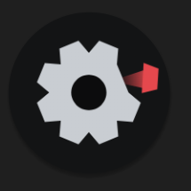

# Gearslip

Bring any app to your car screen.

## What Gearslip is

Gearslip is an Android Auto client for the phone. It speaks the Android Auto protocol
directly to a car head unit over USB, with no Google software in the path. Gearslip acts
as a Car App Library host: an app that ships a car interface hands Gearslip a template,
and Gearslip renders that template natively on the car screen. Nothing is mirrored from
the phone. For apps without a car interface, Gearslip offers a separate screen-sharing
mode.

## Features

- **Phone calls.** Dial from a keypad, or search your contacts, then confirm before the
  call goes out.
- **Navigation.** Gearslip hosts real Car App Library map apps on the car screen; Organic
  Maps and OsmAnd both work today.
- **Music.** Browse, play, and queue tracks from a car-enabled media app, with a Now
  Playing view, an Up Next queue, and lyrics.
- **The web.** A browser template with its own on-screen keyboard, for anything that
  doesn't ship a car interface of its own.
- **Weather and the day ahead.** A dashboard screen shows the week's calendar next to
  the current and coming weather.
- **Notifications.** Read and reply to notifications from the car screen, using the same
  on-screen keyboard.

## Status

- **The connection is wired only, for now.** Plug the phone into the head unit's USB port;
  Gearslip does not yet offer a wireless option.
- **Setup walks you through it.** First launch asks for the Android Auto certificate,
  then one permission at a time, each with a plain reason and an Allow or Skip. A help
  screen inside the car answers anything setup didn't cover.
- **Templated apps work.** Gearslip renders all 16 template types that the Car App
  Library defines, and it draws its own keyboard for search, sign-in, and text fields.
  It has been tested against several real navigation and media apps.
- **Gearslip works with [LIVI](https://github.com/f-io/LIVI),** LIVI, used in open source car dashboards, is fully supported by Gearslip.
- **Audio reaches the car by capturing playback, not by mirroring the screen.** Android
  requires a screen-share style consent dialog and indicator for this, even though
  Gearslip never reads the screen; that grant is the only way a non-privileged app can
  tap another app's audio. The consent normally repeats every drive; two optional adb
  commands in the setup guide reduce it to a one-time grant.
- **Gearslip needs no adb, root, or Shizuku.** Every feature relies on an ordinary
  Android permission or an on-device consent dialog. The two adb commands mentioned
  above, for audio, are the sole exception: both are optional, and both only remove a
  dialog that the driver would otherwise see once per drive.

## Building

```
./gradlew :gearslip:assembleDebug
```

The APK lands at `build/Gearslip-debug.apk`.

A release build needs a signing key. Copy `keystore.properties.example` to
`keystore.properties`, fill in your own values, and run
`./gradlew :gearslip:assembleRelease`. Git ignores both the properties file and the
keystore. Without them, the debug build still works.

## Writing apps for Gearslip

[docs/BUILDING_APPS.md](docs/BUILDING_APPS.md) specifies how to write apps that Gearslip
can render: templated apps, media apps, and the Gearslip app protocol.

## License

Gearslip is licensed under AGPL-3.0; see [LICENSE](LICENSE). The author offers a separate
commercial license for private use outside the AGPL's terms; see [NOTICE.md](NOTICE.md).
