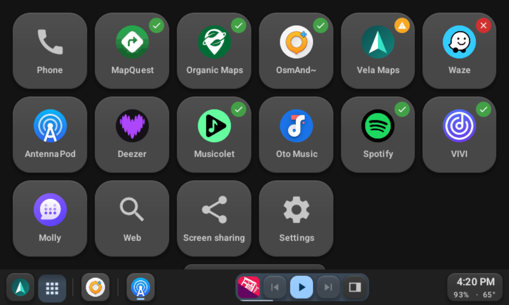
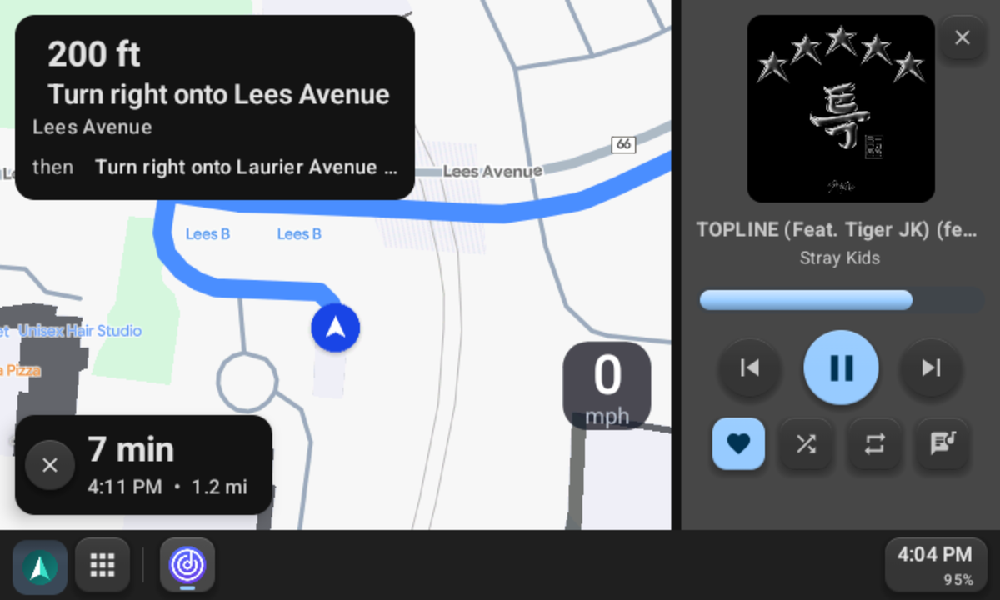
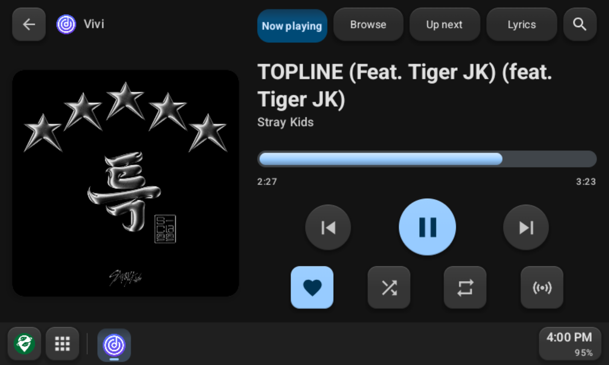
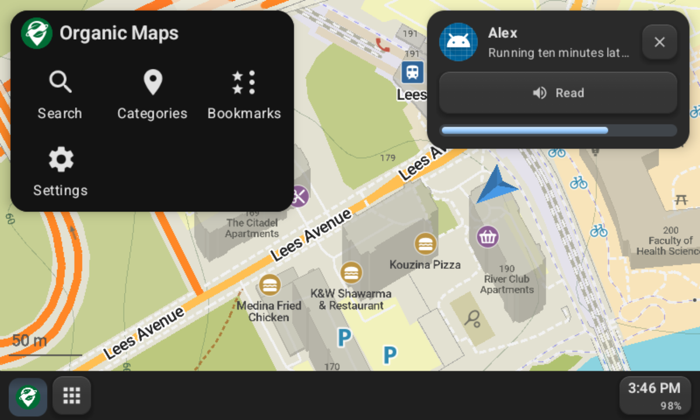
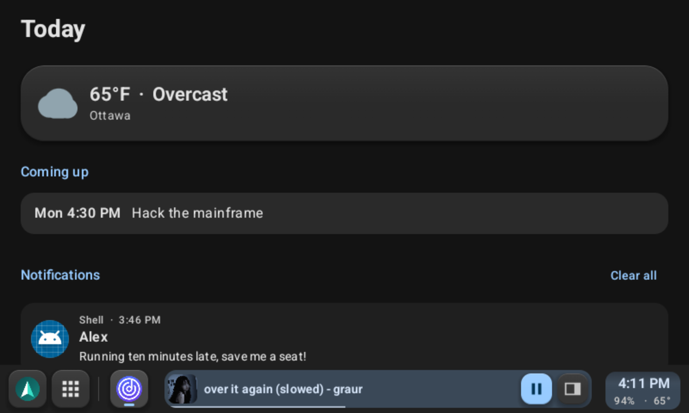
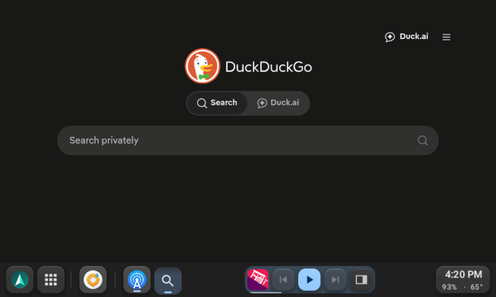

# Gearslip

An Android Auto alternative built for everyone.

[](https://apps.obtainium.imranr.dev/redirect?r=obtainium://add/https://github.com/Seb3thehacker/gearslip)

## Which cars work

Earlier builds used a head-unit certificate that some newer cars rejected. This build
extracts Android Auto's phone-side projection identity from the installed app.

## What Gearslip is

Gearslip is an Android Auto client for the phone. It speaks the Android Auto protocol
directly to a car head unit over USB, with no Google software in the path. Gearslip acts
as a Car App Library host: an app that ships a car interface hands Gearslip a template,
and Gearslip renders that template natively on the car screen. Nothing is mirrored from
the phone. For apps without a car interface, Gearslip offers a separate screen-sharing
mode.

| | |
|---|---|
|  |  |
| Apps sorted by kind. A check marks the ones that work. | Vela Maps navigating, with the player beside it. |
|  |  |
| ViVi Music in Gearslip's player. | A new message, read aloud at a tap, over the map. |
|  |  |
| The weather, your next event, and what you missed. | Browse the web while parked. |

## Features

- **Phone calls.** Dial from a keypad, or search your contacts, then confirm before the
  call goes out.
- **Navigation.** Gearslip hosts real Car App Library map apps on the car screen.
  Organic Maps, OsmAnd, and Flitsmeister work today. Vela runs, with rough
  edges.
- **Music.** Browse, play, and queue tracks from a car-enabled media app, with a Now
  Playing view, an Up Next queue, and lyrics. Type a search, and apps that accept one
  play the best match.
- **The web.** A browser template with its own on-screen keyboard, for anything that
  doesn't ship a car interface of its own.
- **Weather and the day ahead.** A dashboard screen shows the week's calendar next to
  the current and coming weather.
- **Messages.** New messages appear as a small card on the car screen. Gearslip reads
  each one aloud, and you reply by voice or with a quick reply. Music pauses while
  Gearslip speaks or listens. Speech runs on the phone, so it needs no Google account.
- **Notifications.** Only messages, missed calls, alarms, and reminders interrupt you.
  The rest wait on the dashboard.
- **Your apps, your order.** The launcher groups apps by kind: phone, maps, music,
  messaging, and the rest. Press and hold an app to move it.
- **Car controls.** Steering wheel buttons, control knobs, and D-pads all work.
- **Themes.** Choose flat buttons or skeuomorphic ones that look like real keys.

## Status

- **The connection is wired only, for now.** Plug the phone into the head unit's USB port;
  Gearslip does not yet offer a wireless option.
- **Setup walks you through it.** First launch extracts the Android Auto certificate and
  downloads the DHU certificate once, with manual download and import also available.
  It then asks for one permission at a time, with an Allow or Skip. A help
  screen inside the car answers anything setup didn't cover.
- **Templated apps work.** Gearslip renders all 16 template types that the Car App
  Library defines, and it draws its own keyboard for search, sign-in, and text fields.
  It has been tested against several real navigation and media apps.
- **Gearslip works with [LIVI](https://github.com/f-io/LIVI),** the open-source head unit
  used in homemade car dashboards.
- **Some apps refuse Gearslip.** Spotify, Waze, and Google Messages use a version of
  Google's car library that accepts only Android Auto itself. Spotify still plays through
  Gearslip's own player.
- **Calls use the car's Bluetooth,** as they do in Android Auto. Pair the phone with the
  car to hear calls through its speakers.
- **Audio reaches the car by capturing playback, not by mirroring the screen.** Android
  shows a screen-share consent dialog for this, even though Gearslip never reads the
  screen; it is the only way an ordinary app can capture another app's audio. The dialog
  appears once per drive.
- **Gearslip needs no adb, root, or Shizuku.** Every feature relies on an ordinary
  Android permission or an on-device consent dialog. The setup guide offers two optional
  adb commands: one removes the audio dialog for good, and the other keeps notifications
  visible while audio plays.

## Usage notes

Gearslip can send short notes that show which cars it works in. They stay off unless you
turn them on, in setup or in Settings.

- **When they go out.** When you open Gearslip, at most once a day, and after each drive.
  Nothing runs in the background.
- **What they carry.** The Gearslip version, plus whatever you tick: the Android version
  and whether the phone runs GrapheneOS, the phone model, whether a car connected that
  day, and each car's head unit, model, year, screen size, and connection result.
  Settings shows the exact note.
- **What they leave out.** Your name, accounts, location, contacts, messages, and
  anything you type or play.
- **How phones are counted.** A random number counts each phone once. The server keeps
  only a salted hash of it.
- **Where they go.** To a Cloudflare Worker, whose code is in
  [stats-worker/](stats-worker/). Cloudflare sees your IP address in delivering a note,
  as it would for any website; the Worker doesn't store it.

Turn the notes off, and they stop at once.

## Building

```
./gradlew :gearslip:assembleDebug
```

The APK lands at `build/Gearslip-debug.apk`.

A release build needs a signing key. Copy `keystore.properties.example` to
`keystore.properties`, fill in your own values, and run
`./gradlew :gearslip:assembleRelease`. Git ignores both the properties file and the
keystore. Without them, the debug build still works.

## Writing apps for Gearslip

[docs/BUILDING_APPS.md](docs/BUILDING_APPS.md) specifies how to write apps that Gearslip
can render: templated apps, media apps, and the Gearslip app protocol.

## Projection identity

Gearslip ships no projection certificates or private keys. On each process start, it
reads the installed Android Auto APK (including splits), extracts its CarService
certificate chain, and decrypts the matching private key. A process-lifetime package
broadcast receiver refreshes it when Android Auto is installed or updated. Startup
also catches updates made while Gearslip was stopped. **Keep Android Auto installed
but disabled** so it cannot claim the car's USB connection.

During certificate setup, Gearslip downloads Google's official
[Desktop Head Unit 2.0 archive](https://dl.google.com/android/repository/desktop-head-unit-linux-x64_r02.0.zip),
checks its SHA-256, and extracts its head-unit certificate and private key on the phone.
It reads the desktop executable as data; it never executes it. The archive is discarded,
and the extracted identity is saved in private app storage. Successful setup is reused
across restarts and Android Auto updates, with no further DHU download. If setup fails,
it can be retried from **Settings → Certificate → Projection certificate → Certificate setup**.

The existing aasdk download and PKCS#12 import remain available in setup and
**Settings → Certificate**. Imported, downloaded, and adb-staged certificates keep their
existing priority. When none is supplied, Gearslip uses the selected extracted identity.
**Projection certificate** lets you choose Android Auto or **Head unit (DHU)**. The
choice applies to the next connection and remains selected until you change it. Setup
initially selects DHU if no Android Auto identity is available. Expiry or connection
failure does not switch identities automatically.

Extraction checks certificate signatures and verifies that the private key matches.
A failed Android Auto refresh preserves the last valid identity and reports the error
in the certificate picker. If a future APK changes its key format, use the DHU option
or import your own certificate until the extractor is updated. If no extracted or
manually supplied identity is available, the existing self-signed fallback remains;
most cars will reject it.

The extractor was verified against Android Auto **17.9.664004**, whose phone certificate
expires on **20 January 2027 at 22:48:17 UTC**. Its SHA-256 fingerprint is
`39b7417be3f2bcd60b30e3acd4a2995d82661d6d66110e45c10a15d2a3c2ee6e`.
DHU 2.0's `Android-Auto-Internal` certificate expires on **1 August 2048 at 17:21:23 UTC**;
its fingerprint is `4eb581dcee2b84369ca87066ab6eaa73a4783aef5c7b6edc6841e066cffa7e7c`.
Settings shows the actual active certificate and expiry. An expired Android Auto
certificate produces a dismissible warning; some head units may still accept it.
The DHU identity's acceptance in the phone role depends on the car and needs real-car
validation. It is distinct from aasdk's JVC Kenwood identity.

Unit tests generate their own certificate material. Optional integration tests read
external reference downloads without copying their keys into the repository:

```sh
./gradlew :gearslip:testDebugUnitTest \
  -PgearslipReferenceApkm=/path/to/android-auto-17.9.664004.apkm \
  -PgearslipReferenceDhu=/path/to/desktop-head-unit-linux-x64_r02.0.zip
```

These identities are separate from Gearslip's APK signing key. They do not replace the
remaining protocol implementation or third-party apps' host authorization checks.

## Trademarks

Android, Android Auto, Google Messages, and Waze are trademarks of Google LLC. Spotify is
a trademark of Spotify AB. Gearslip is not affiliated with, endorsed by, or sponsored by
any of these companies. All other names belong to their owners.

## License

Gearslip is licensed under AGPL-3.0; see [LICENSE](LICENSE). The author offers a separate
commercial license for private use outside the AGPL's terms; see [NOTICE.md](NOTICE.md).
